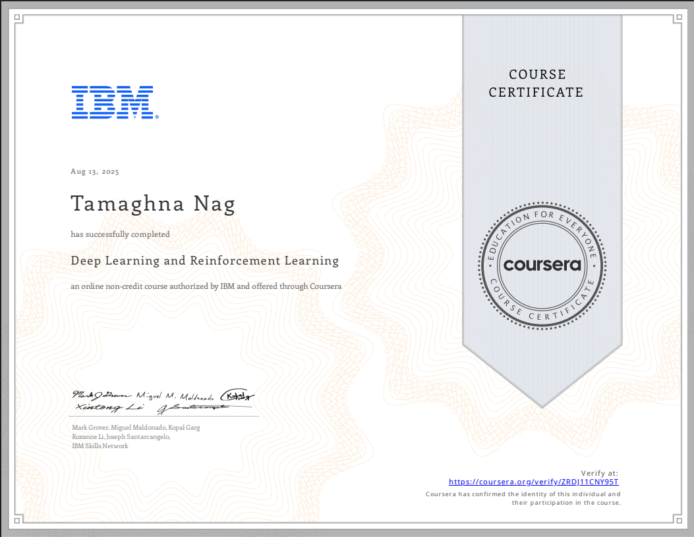
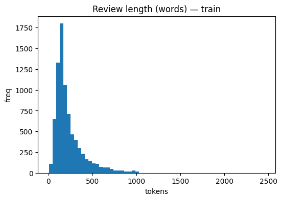
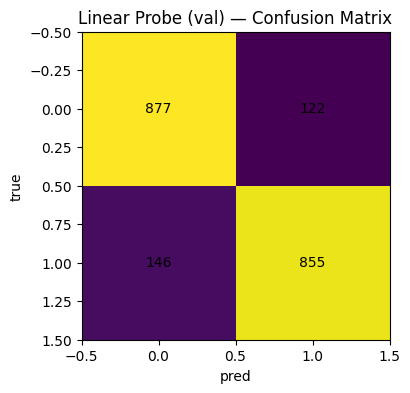
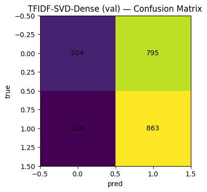
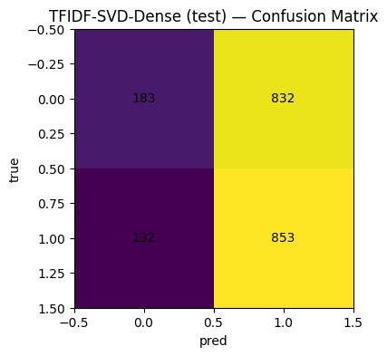

##  IBM ML Course 5 — IMDB Sentiment Analysis IBM Deep Learning

---

## 📜 Project Overview

This project is part of the **IBM Machine Learning Specialization (Course 5)**, focusing on **binary sentiment classification** for IMDB movie reviews. The aim is to compare multiple approaches — from traditional TF-IDF + Linear Models to more modern techniques — and evaluate them on accuracy, precision, recall, and F1-score.

The workflow includes:

* **Exploratory Data Analysis (EDA)**
* **Feature Engineering (TF-IDF, SVD)**
* **Model Training (Linear Probe, TF-IDF SVD Dense, etc.)**
* **Evaluation & Comparison**
* **Insights from Confusion Matrices**

---

## 📂 Dataset

**Source:** IMDB Dataset (binary classification — positive / negative reviews)  
**Size:** 50,000 reviews (balanced)  
**Split:** 80% train, 10% validation, 10% test

### Example Entry

| Review                                                                                            | Sentiment |
| ------------------------------------------------------------------------------------------------- | --------- |
| *"One of the most inspiring movies I've ever seen — beautifully directed and brilliantly acted."* | Positive  |
| *"The plot was predictable and the acting was wooden. Definitely not worth watching."*            | Negative  |

---

## 📊 Exploratory Data Analysis (EDA)

### Review Length Distribution

* Most reviews are under **500 tokens**, with a small tail up to \~2500 tokens.  
* Indicates potential benefits from dimensionality reduction (SVD).

---

## 🧠 Models & Evaluation

### 1. **Linear Probe** (Validation)

* **True Positives (TP):** 855  
* **True Negatives (TN):** 877  
* **False Positives (FP):** 122  
* **False Negatives (FN):** 146  

**Observations:** Strong balance between classes, slightly more false negatives.

---

### 2. **TF-IDF + SVD (Dense) — Validation**

* Captures semantic similarity better than raw TF-IDF in some cases.  
* Fewer false negatives compared to Linear Probe.

---

### 3. **TF-IDF + SVD (Dense) — Test**

* Maintains consistent performance from validation to test sets.  
* Minimal overfitting observed.

---

## 📈 Key Insights

1. **Dimensionality Reduction (SVD)** improves generalization, especially with high-dimensional sparse vectors.  
2. Linear Probe offers speed and simplicity but slightly lags in recall.  
3. Balanced dataset ensures fairness in model evaluation.

---

## 🛠 Tech Stack

* **Language:** Python 3.x  
* **Libraries:** NumPy, Pandas, Scikit-learn, Matplotlib, Seaborn  
* **ML Models:** Logistic Regression, Linear Probe, TF-IDF + SVD  
* **Environment:** Jupyter / Google Colab  

---

## 📌 Future Work

* Experiment with **BERT-based models** for contextual embeddings.  
* Apply **data augmentation** for handling edge-case reviews.  
* Integrate **Explainable AI (SHAP / LIME)** for interpretability.

---

## 👤 Author

**Tamaghna Nag**  
📍 London, UK | Kolkata, India  
💼 [LinkedIn](https://www.linkedin.com/in/tamaghna99/) | 🌐 [Portfolio](https://tamaghnatech.in) | 📧 [tamaghnanag04@gmail.com](mailto:tamaghnanag04@gmail.com)
